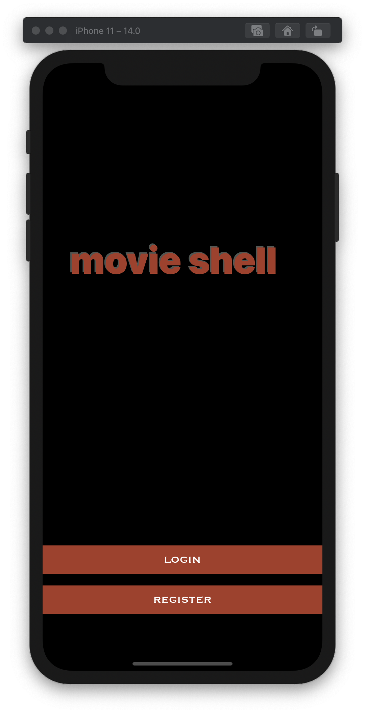
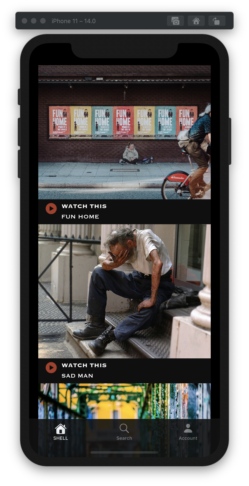
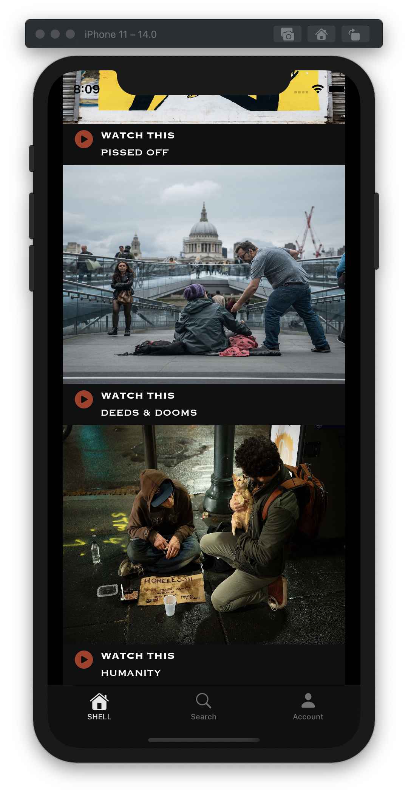
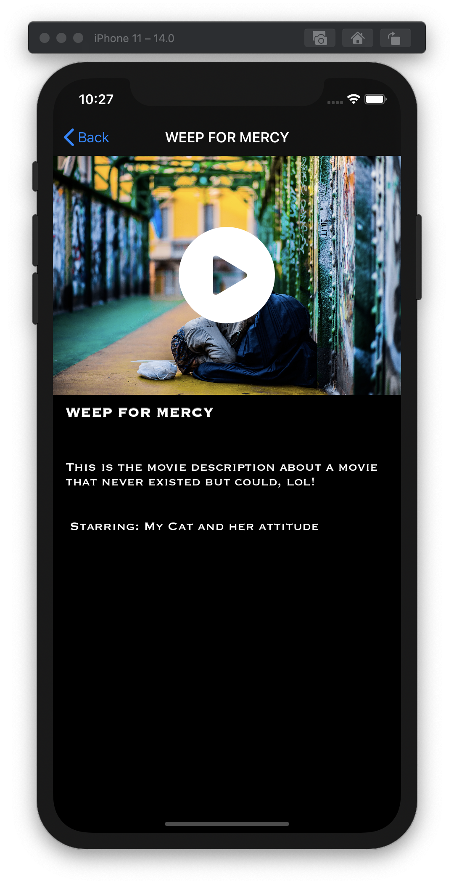

# Movie Shell

## Video Streaming Application

## My Goal

This began as a challenge to see how long it'd take for me to come up with a single page module consisting of a list of movie cover images and titles. This includes a UITable module embedded in this module are movie properties (Images and Titles). A navigation bar and Tab bar are also implemented. The goal is to implement the landing page of a movie streaming platform. It took me about a night and a morning to achieve what you can find in the first commit.

## Progress

1. I have achieved my goal of creating a basic landing page. I will now be building upon this to see how far I can go with the movie streaming application.

